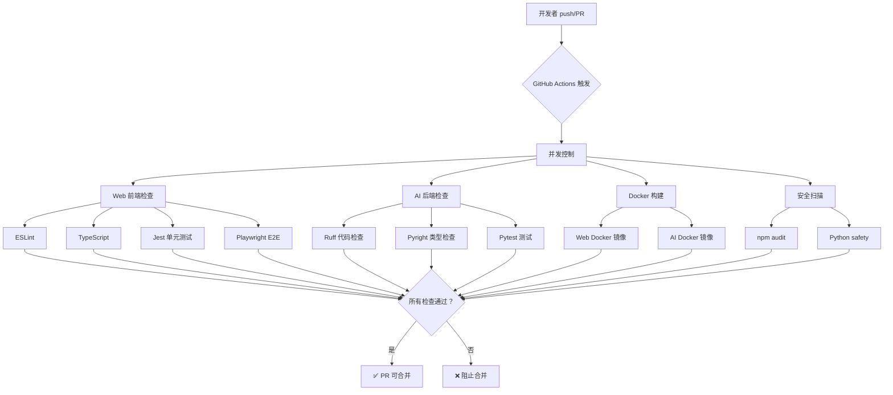

# CI/CD 流程详细解析

## 一、CI/CD 流程全景图



---

## 二、技术栈细分

### 2.1 前端技术栈 (Web)

| 工具 | 用途 | 配置位置 |
|------|------|----------|
| **ESLint** | 代码风格和质量检查 | `apps/web/.eslintrc.json` |
| **TypeScript** | 类型检查 | `apps/web/tsconfig.json` |
| **Jest** | 单元测试框架 | `apps/web/jest.config.js` |
| **Playwright** | E2E 测试框架 | `apps/web/playwright.config.ts` |
| **Testing Library** | React 测试工具 | `apps/web/package.json` |

**检查项**：
```yaml
# 1. ESLint (快速 ~30 秒)
npm run lint
# 检查：代码风格、React 规则、Next.js 规则

# 2. TypeScript (中速 ~1 分钟)
npx tsc --noEmit
# 检查：类型错误、接口定义、泛型约束

# 3. Jest 单元测试 (中速 ~2 分钟)
npm test -- --coverage
# 检查：组件测试、API 测试、工具函数测试

# 4. Playwright E2E (慢速 ~5 分钟)
npm run test:e2e
# 检查：完整用户流程、跨浏览器测试
```

---

### 2.2 后端技术栈 (AI Service)

| 工具 | 用途 | 配置位置 |
|------|------|----------|
| **Ruff** | Python 代码检查 | `apps/ai-service/pyproject.toml` |
| **Pyright** | Python 类型检查 | `apps/ai-service/pyrightconfig.json` |
| **Pytest** | Python 测试框架 | `apps/ai-service/pytest.ini` |
| **pytest-cov** | 测试覆盖率 | `apps/ai-service/pytest.ini` |

**检查项**：
```yaml
# 1. Ruff (快速 ~20 秒)
ruff check .
# 检查：PEP8 风格、常见错误、代码质量

# 2. Pyright (中速 ~1 分钟)
pyright
# 检查：类型注解、参数类型、返回值类型

# 3. Pytest (中速 ~3 分钟，含数据库)
pytest --cov=app --cov-report=xml
# 检查：API 测试、数据库测试、业务逻辑测试
```

---

### 2.3 Docker 构建

| 工具 | 用途 | 配置位置 |
|------|------|----------|
| **Docker Buildx** | 多平台构建 | `.github/workflows/ci-cd.yml` |
| **BuildKit** | 构建缓存优化 | `apps/web/Dockerfile` |

**检查项**：
```yaml
# 1. Web Docker 镜像 (慢速 ~3 分钟)
docker build -t visual-pbl-web:pr-check apps/web/
# 检查：Dockerfile 语法、依赖安装、构建成功

# 2. AI Docker 镜像 (慢速 ~2 分钟)
docker build -t visual-pbl-ai-service:pr-check apps/ai-service/
# 检查：Dockerfile 语法、依赖安装、构建成功
```

---

### 2.4 安全扫描

| 工具 | 用途 | 检查级别 |
|------|------|----------|
| **npm audit** | Node.js 依赖安全 | moderate |
| **safety** | Python 依赖安全 | default |

**检查项**：
```yaml
# 1. npm audit (快速 ~30 秒)
cd apps/web && npm audit --audit-level=moderate
# 检查：已知安全漏洞、过时依赖

# 2. Python safety (快速 ~30 秒)
pip install safety && safety check -r requirements.txt
# 检查：已知安全漏洞、不安全依赖
```

---

## 三、CI 检查严格程度分析

### 3.1 当前配置的检查数量

| 类别 | 检查项 | 数量 | 必须通过 |
|------|--------|------|----------|
| **前端** | ESLint | 1 | ✅ |
| **前端** | TypeScript | 1 | ✅ |
| **前端** | Jest 单元测试 | 1 | ✅ |
| **前端** | Playwright E2E | 1 | ✅ |
| **后端** | Ruff | 1 | ✅ |
| **后端** | Pyright | 1 | ✅ |
| **后端** | Pytest | 1 | ✅ |
| **Docker** | Web 镜像构建 | 1 | ✅ |
| **Docker** | AI 镜像构建 | 1 | ✅ |
| **安全** | npm audit | 1 | ⚠️ (警告) |
| **安全** | Python safety | 1 | ⚠️ (警告) |
| **总计** | | **11 个必须通过** | |

---

### 3.2 是否过于严格？

**优点**：
- ✅ **代码质量高** - 所有代码经过多层检查
- ✅ **类型安全** - TypeScript 和 Pyright 保证类型正确
- ✅ **测试覆盖** - 单元测试 + E2E 测试双重保障
- ✅ **安全性** - 依赖漏洞扫描
- ✅ **Docker 可靠性** - 确保容器化部署成功

**缺点**：
- ❌ **CI 时间长** - 完整检查需要 10-15 分钟
- ❌ **反馈慢** - 开发者需要等待很久才知道结果
- ❌ **容易失败** - 任何一个检查失败就阻止合并
- ❌ **开发体验差** - 频繁 CI 失败影响积极性

---

### 3.3 优化建议

#### 方案 A：分级检查（推荐）

```yaml
# 快速检查（PR 必须通过）
- ESLint
- TypeScript
- 单元测试（只运行相关测试）

# 慢速检查（后台运行，不阻止合并）
- E2E 测试 → 改为 nightly build
- Docker 构建 → 改为 merge 后运行
- 安全扫描 → 改为警告级别
```

#### 方案 B：按分支分级

```yaml
# main 分支：所有检查
- 所有检查必须通过

# feature 分支：只运行快速检查
- ESLint
- TypeScript
- 单元测试（相关）

# PR 到 main：所有检查
- 完整检查套件
```

#### 方案 C：按文件类型智能选择

```yaml
# 只修改前端文件
- 前端检查 + 单元测试

# 只修改后端文件
- 后端检查 + 单元测试

# 修改全栈代码
- 所有检查
```

---

## 四、CI 失败常见原因

### 4.1 前端失败原因

| 错误类型 | 常见原因 | 解决方案 |
|----------|----------|----------|
| **ESLint** | 代码风格、未使用变量 | `npm run lint:fix` |
| **TypeScript** | 类型不匹配、缺少定义 | 修复类型错误 |
| **Jest** | 测试失败、快照过期 | 修复代码或更新快照 `-u` |
| **Playwright** | 元素找不到、超时 | 检查选择器、增加超时 |

### 4.2 后端失败原因

| 错误类型 | 常见原因 | 解决方案 |
|----------|----------|----------|
| **Ruff** | PEP8 风格、导入顺序 | `ruff check --fix` |
| **Pyright** | 类型注解缺失 | 添加类型定义 |
| **Pytest** | 测试失败、数据库连接 | 修复代码、检查测试数据 |

### 4.3 Docker 失败原因

| 错误类型 | 常见原因 | 解决方案 |
|----------|----------|----------|
| **构建失败** | 依赖安装失败、语法错误 | 检查 Dockerfile、requirements.txt |
| **镜像过大** | 包含不必要的文件 | 使用 `.dockerignore` |

---

## 五、本地 Pre-commit vs CI

### 5.1 Pre-commit 检查项

```bash
# 本地 pre-commit (快速 ~10 秒)
1. ESLint (警告，不阻止)
2. TypeScript (错误，阻止) ← 必须通过
3. 智能测试选择 (错误，阻止) ← 只运行相关测试
```

### 5.2 CI 检查项

```bash
# GitHub CI (完整 ~10-15 分钟)
1. ESLint (必须通过)
2. TypeScript (必须通过)
3. Jest 单元测试 (必须通过，完整套件)
4. Playwright E2E (必须通过) ← 本地不运行
5. Ruff (必须通过)
6. Pyright (必须通过)
7. Pytest (必须通过)
8. Docker 构建 (必须通过) ← 本地可能不测试
9. 安全扫描 (警告)
```

### 5.3 本地通过 ≠ CI 通过

**原因**：

| 差异 | 说明 |
|------|------|
| **测试范围** | 本地只运行相关测试，CI 运行完整套件 |
| **测试环境** | 本地是 Windows，CI 是 Linux |
| **E2E 测试** | 本地不运行 Playwright，CI 必须运行 |
| **Docker 构建** | 本地可能不测试 Docker，CI 必须构建 |
| **后端检查** | 本地可能只检查前端，CI 检查前后端 |

---

## 六、GitHub CI 状态获取

### 6.1 使用 GitHub CLI 获取 CI 状态

**安装 GitHub CLI**：
```bash
# Windows (PowerShell)
winget install GitHub.cli

# 或使用 Chocolatey
choco install gh
```

**认证**：
```bash
gh auth login
```

**获取 CI 状态**：
```bash
# 查看当前分支的 CI 状态
gh run list --branch <your-branch> --limit 5

# 查看详细结果
gh run view <run-id>

# 查看失败的日志
gh run view <run-id> --log --failed
```

### 6.2 使用 API 获取 CI 状态

```bash
# 获取 PR 的 CI 状态
curl -H "Authorization: token $GITHUB_TOKEN" \
  https://api.github.com/repos/<owner>/<repo>/commits/<sha>/check-runs
```

### 6.3 本地脚本获取 CI 状态

已存在的脚本：`scripts/check-ci-status.sh`

```bash
#!/bin/bash
# 使用 GitHub CLI 检查 CI 状态
gh pr list --state open \
  --json number,headRefName,checkRuns | \
  jq -r '.[] | "\(.headRefName): \(.checkRuns | map(select(.conclusion == "failure")) | length) failures"'
```

**使用方法**：
```bash
bash scripts/check-ci-status.sh
```

---

## 七、确保 CI 通过的完整流程

### 7.1 本地完整检查流程

```bash
# 1. 运行 pre-commit（快速检查）
git commit -m "feat: add new feature"

# 2. 手动运行完整测试套件（模拟 CI）
# 前端
cd apps/web
npm run lint
npx tsc --noEmit
npm test
npm run test:e2e  # 可选，耗时较长

# 后端
cd apps/ai-service
ruff check .
pyright
pytest

# 3. Docker 构建测试
cd docker
docker-compose -f docker-compose.dev.yml build
```

### 7.2 自动检查脚本

创建 `scripts/local-ci-check.sh`：

```bash
#!/bin/bash
# scripts/local-ci-check.sh
# 本地运行完整 CI 检查

set -e

echo "=== 本地 CI 检查 ==="

# 前端检查
echo "=== 前端检查 ==="
cd apps/web
npm run lint || { echo "❌ ESLint 失败"; exit 1; }
npx tsc --noEmit || { echo "❌ TypeScript 失败"; exit 1; }
npm test -- --passWithNoTests || { echo "❌ 单元测试失败"; exit 1; }
# npm run test:e2e || { echo "❌ E2E 测试失败"; exit 1; }  # 可选

# 后端检查
echo "=== 后端检查 ==="
cd ../ai-service
ruff check . || { echo "❌ Ruff 失败"; exit 1; }
pyright || { echo "❌ Pyright 失败"; exit 1; }
pytest || { echo "❌ Pytest 失败"; exit 1; }

# Docker 构建检查
echo "=== Docker 构建检查 ==="
cd ../../docker
docker-compose -f docker-compose.dev.yml build || { echo "❌ Docker 构建失败"; exit 1; }

echo "=== ✅ 所有本地 CI 检查通过 ==="
```

---

## 八、CI 失败自动修复

### 8.1 自动修复脚本

已存在的脚本：`scripts/fix-all-ci-errors.sh`

```bash
# 自动修复所有 feature 分支的 CI 错误
bash scripts/fix-all-ci-errors.sh
```

### 8.2 手动修复流程

```bash
# 1. 查看 CI 失败原因
gh run view --log --failed

# 2. 拉取最新代码
git checkout feature/your-branch
git pull origin feature/your-branch

# 3. 前端修复
cd apps/web
npm run lint:fix
# 手动修复 TypeScript 错误

# 4. 后端修复
cd apps/ai-service
ruff check --fix .
# 手动修复 Pyright 错误

# 5. 提交修复
git add -A
git commit -m "fix: resolve CI failures"
git push origin feature/your-branch
```

---

## 九、最佳实践建议

### 9.1 开发者日常流程

```bash
# 开发中
1. 编写代码
2. 运行相关测试（npm test -- --watch）
3. git add && git commit（触发 pre-commit）
4. git push

# 推送前
1. 运行本地完整检查（可选）
   bash scripts/local-ci-check.sh

# 推送后
1. 查看 GitHub Actions 状态
2. 如果失败，查看日志并修复
3. 重新推送触发 CI
```

### 9.2 减少 CI 失败的技巧

1. **保持 pre-commit 与 CI 一致**
   - Pre-commit 检查项应该包含 CI 的核心检查
   - 至少包含：ESLint、TypeScript、相关单元测试

2. **定期同步 main 分支**
   ```bash
   git checkout main
   git pull origin main
   git checkout feature/your-branch
   git merge main
   # 解决冲突后推送
   git push
   ```

3. **小步提交，频繁推送**
   - 每次只修改少量代码
   - 频繁推送到远程，尽早发现 CI 问题

4. **使用自动修复工具**
   ```bash
   # 前端
   npm run lint:fix
   
   # 后端
   ruff check --fix .
   ruff format .
   ```

---

## 十、配置优化建议

### 10.1 分级检查配置

```yaml
# .github/workflows/ci-cd.yml

# 快速检查（PR 必须）
quick-check:
  - ESLint
  - TypeScript
  - 单元测试（只运行修改相关文件）

# 完整检查（main 分支必须）
full-check:
  - 快速检查所有项
  - E2E 测试
  - Docker 构建
  - 安全扫描
```

### 10.2 按文件类型智能选择

```yaml
# 检测修改的文件类型
- name: Detect changes
  id: changes
  run: |
    echo "web_changed=$(git diff --name-only HEAD^ HEAD | grep -c 'apps/web' || echo 0)" >> $GITHUB_OUTPUT
    echo "ai_changed=$(git diff --name-only HEAD^ HEAD | grep -c 'apps/ai-service' || echo 0)" >> $GITHUB_OUTPUT

# 条件运行检查
- name: Web Tests
  if: steps.changes.outputs.web_changed > 0
  run: npm test
```

---

## 十一、总结

### 11.1 关键要点

| 问题 | 答案 |
|------|------|
| **CI 是否过于严格？** | 是的，可以优化分级检查 |
| **本地 pre-commit 通过 = CI 通过？** | 不一定，CI 还有 E2E、Docker 等额外检查 |
| **如何获取 CI 状态？** | 使用 `gh run list` 或 GitHub API |
| **如何确保 CI 通过？** | 保持 pre-commit 与 CI 一致 + 本地完整检查 |

### 11.2 推荐工具

| 工具 | 用途 |
|------|------|
| **GitHub CLI (gh)** | 查看 CI 状态、日志 |
| **本地 CI 检查脚本** | 模拟 CI 环境 |
| **自动修复脚本** | 批量修复 CI 错误 |
| **Pre-commit hooks** | 提交前快速检查 |

### 11.3 下一步行动

1. **安装 GitHub CLI**
   ```bash
   winget install GitHub.cli
   gh auth login
   ```

2. **创建本地 CI 检查脚本**
   ```bash
   touch scripts/local-ci-check.sh
   # （见上方脚本内容）
   ```

3. **优化 CI 配置（可选）**
   - 考虑分级检查
   - 考虑按文件类型智能选择
   - 考虑 E2E 测试改为 nightly build

4. **保持 pre-commit 与 CI 同步**
   - 定期更新 pre-commit hook
   - 确保包含核心检查项
